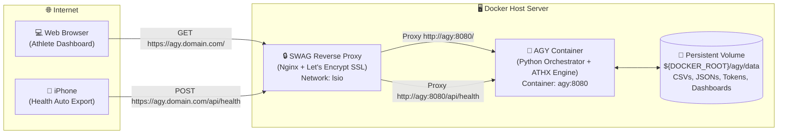

# 🐳 ATHX 2027 / AGY — Docker & SWAG Deployment Guide

This guide explains how to package, deploy, and expose **ATHX 2027 (AGY)** on a remote Docker server using **LinuxServer.io SWAG** (Secure Web Application Gateway) as the reverse proxy with automated SSL.

---

## 🏛️ Architecture Overview

The containerized deployment exposes the complete ATHX intelligence suite:



### Key Highlights
- **Zero-Friction Access**: Access your ATHX Headquarters Dashboard at `https://agy.yourdomain.com/` from any browser worldwide.
- **Background iOS Ingestion**: iPhone Health Auto Export pushes biometrics continuously to `https://agy.yourdomain.com/api/health` without requiring home Wi-Fi or VPN.
- **Safe Persistence**: All CSV datasets, Garmin OAuth tokens, iCloud/Google Calendar caches, logs, and generated HTML dashboards live in `${DOCKER_ROOT}/agy/data` and persist across container updates.
- **Auto-Seeding**: On first run, the container automatically populates missing datasets into your persistent data volume.

---

## 📋 Prerequisites

1. A server with **Docker** and **Docker Compose** installed.
2. An existing **SWAG** container running and attached to the Docker network named `lsio` (`networks: lsio: external: true`).
3. A DNS record configured for your domain:
   - **Type**: `CNAME`
   - **Host / Name**: `agy`
   - **Target**: `yourdomain.com` (or your DDNS hostname)

---

## 🚀 Deployment Instructions

### 1. Server Directory Setup

On your server, create the required directories under your Docker root (e.g. `/home/user/docker` or `/opt/docker`):

```bash
export DOCKER_ROOT="/home/user/docker"
mkdir -p "${DOCKER_ROOT}/agy/data"
```

If you already have existing Garmin tokens (`garmin_tokens/`) or Google Calendar credentials (`credentials.json`), copy them into `${DOCKER_ROOT}/agy/data/`.

---

### 2. Configure SWAG Reverse Proxy

Copy the provided Nginx configuration file [`swag/agy.subdomain.conf`](file:///swag/agy.subdomain.conf) into SWAG's proxy configuration directory on the server:

```bash
# Path inside SWAG config volume on your host:
cp swag/agy.subdomain.conf ${DOCKER_ROOT}/swag/nginx/proxy-confs/agy.subdomain.conf
```

#### SWAG Configuration (`agy.subdomain.conf`):
```nginx
server {
    listen 443 ssl;
    listen [::]:443 ssl;

    server_name agy.*;

    include /config/nginx/ssl.conf;
    client_max_body_size 50M;

    # MAIN LOCATION: ATHX Athlete Dashboard & Multi-Calendar UI
    location / {
        include /config/nginx/proxy.conf;
        include /config/nginx/resolver.conf;
        set $upstream_app agy;
        set $upstream_port 8080;
        set $upstream_proto http;
        proxy_pass $upstream_proto://$upstream_app:$upstream_port;
    }

    # API & WEBHOOK LOCATION: iOS Health Auto Export
    # Kept without interactive SSO login so background mobile sync is never blocked
    location /api/ {
        include /config/nginx/proxy.conf;
        include /config/nginx/resolver.conf;
        set $upstream_app agy;
        set $upstream_port 8080;
        set $upstream_proto http;
        proxy_pass $upstream_proto://$upstream_app:$upstream_port;
    }

    # Healthcheck endpoint
    location /health {
        include /config/nginx/proxy.conf;
        include /config/nginx/resolver.conf;
        set $upstream_app agy;
        set $upstream_port 8080;
        set $upstream_proto http;
        proxy_pass $upstream_proto://$upstream_app:$upstream_port;
    }
}
```

Reload SWAG to apply the new subdomain configuration:
```bash
docker exec -it swag nginx -s reload
```

---

### 3. Production Docker Compose (`docker-compose.prod.yml`)

Place the following compose configuration in your AGY directory on the server:

```yaml
services:
  agy:
    image: ghcr.io/ayrtonxandre/agy:latest
    # Or build locally:
    # build:
    #   context: .
    #   dockerfile: Dockerfile
    container_name: agy
    restart: unless-stopped
    ports:
      # Optional host port mapping for direct/internal network access
      - "${AGY_HOST_PORT:-8095}:8080"
    environment:
      - PORT=8080
      - TZ=${TZ:-Europe/Paris}
      - PYTHONUNBUFFERED=1
      # Optional: Apple Health MCP Bearer Token
      - HAE_MCP_TOKEN=${HAE_MCP_TOKEN:-}
      # Optional: Background sync frequency in hours (e.g. 6). Set to 0 to disable.
      - SYNC_INTERVAL_HOURS=${SYNC_INTERVAL_HOURS:-6}
    volumes:
      # Persistent biometrics, Garmin caches, tokens, and compiled HTML dashboards
      - ${DOCKER_ROOT}/agy/data:/app/data
    networks:
      - lsio
    healthcheck:
      test: ["CMD", "curl", "-f", "http://localhost:8080/health"]
      interval: 30s
      timeout: 5s
      retries: 3
      start_period: 10s

networks:
  lsio:
    external: true
```

---

### 4. Environment Variables (`.env`)

Create a `.env` file next to `docker-compose.prod.yml`:

```ini
DOCKER_ROOT=/home/user/docker
AGY_HOST_PORT=8095
TZ=Europe/Paris
PORT=8080
SYNC_INTERVAL_HOURS=6
```

---

### 5. Launch the Container

```bash
# Pull the latest image and launch in detached mode:
docker compose -f docker-compose.prod.yml up -d

# Verify container health:
docker ps --filter "name=agy"
```

Check the startup logs:
```bash
docker logs -f agy
```

You should see:
```
==========================================================
🚀 Initializing ATHX 2027 / AGY Container Environment
   Data Directory: /app/data
   Timezone:       Europe/Paris
   Port:           8080
==========================================================
✔ Environment ready. Launching application process...
🚀 Athlete Orchestrator Server running on port 8080
  • Athlete Dashboard  : http://0.0.0.0:8080/
  • Calendar Dashboard : http://0.0.0.0:8080/calendar
  • Healthcheck        : http://0.0.0.0:8080/health
  • Webhook Endpoint   : http://0.0.0.0:8080/api/health
```

---

## 📱 iPhone Health Auto Export Configuration

To sync your Apple Health metrics (weight, body fat, sleep, active energy, protein, calories) from anywhere in the world:

1. Open **Health Auto Export** on your iPhone.
2. Go to **Automations** ➔ **Add Automation** (or edit existing).
3. Set **Export Type**: `REST API (JSON)`.
4. Set **URL**:
   ```
   https://agy.yourdomain.com/api/health
   ```
5. Set **HTTP Method**: `POST`.
6. Set **Headers**:
   - `Content-Type`: `application/json`
   - *(Optional)* `x-api-key`: your token if set in `HAE_MCP_TOKEN`.
7. Enable **Background Sync** / Schedule hourly or upon workout completion.
8. Tap **Test Connection** — you should receive a `200 OK` response with:
   ```json
   {
     "status": "success",
     "updates": {
       "body_composition": 1,
       "sleep": 1,
       "daily_activity": 1,
       "nutrition": 1
     }
   }
   ```

---

## 🌐 Endpoints Reference

| Endpoint | Method | Description |
| :--- | :--- | :--- |
| `https://agy.yourdomain.com/` | `GET` | **ATHX 2027 Athlete Headquarters Dashboard** (Workout volume, e1RMs, biometrics, weight trends). |
| `https://agy.yourdomain.com/calendar` | `GET` | **Unified Multi-Calendar Schedule** (iCloud, Google, Clariane workouts & rest days). |
| `https://agy.yourdomain.com/health` | `GET` | **Healthcheck** endpoint for Docker & SWAG uptime monitoring (returns JSON 200 OK). |
| `https://agy.yourdomain.com/api/health` | `POST` | **Webhook ingestion** for Apple Health Auto Export payloads. Auto-rebuilds dashboard. |
| `https://agy.yourdomain.com/api/rebuild` | `POST` | Manually triggers recompilation of the unified athlete dashboard. |
| `https://agy.yourdomain.com/api/sync/garmin`| `POST` | Triggers live Garmin Connect strength workout extraction & rebuilds dashboard. |

---

## 🔄 Updating & Maintenance

### Update to Latest Image
When new updates are pushed to GitHub, update the running container:
```bash
docker compose -f docker-compose.prod.yml pull
docker compose -f docker-compose.prod.yml up -d
```

### Backing Up Data
All your biometrics, Garmin caches, and tokens live safely in `${DOCKER_ROOT}/agy/data`.
To make a backup:
```bash
tar -czvf agy_backup_$(date +%Y%m%d).tar.gz -C ${DOCKER_ROOT}/agy data
```
